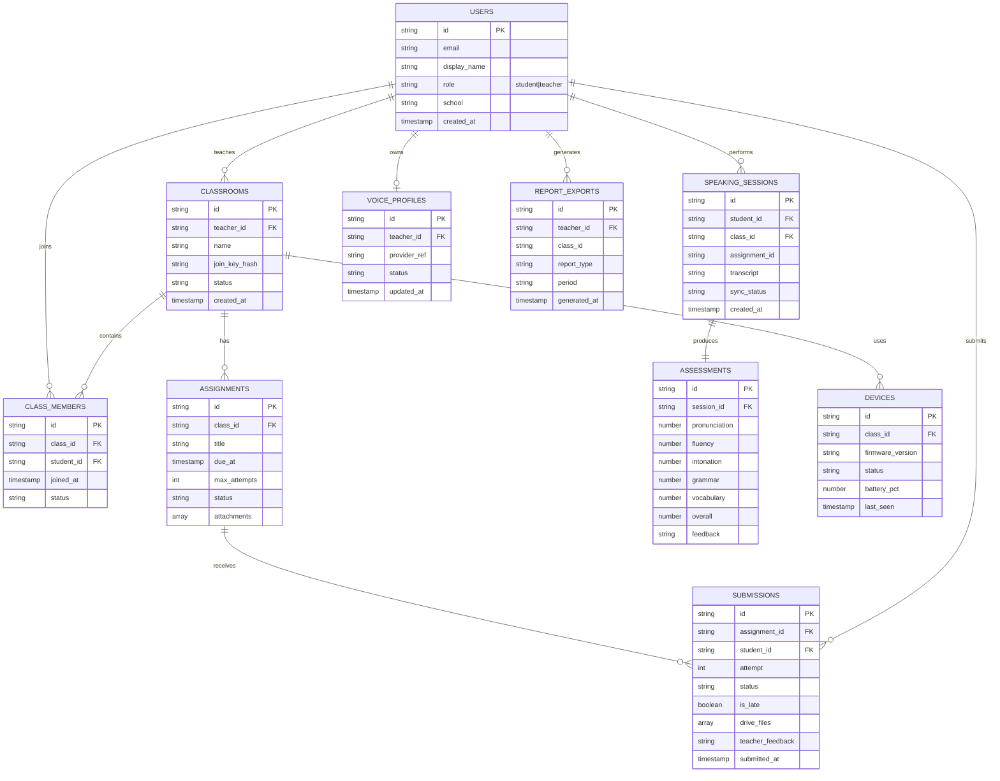
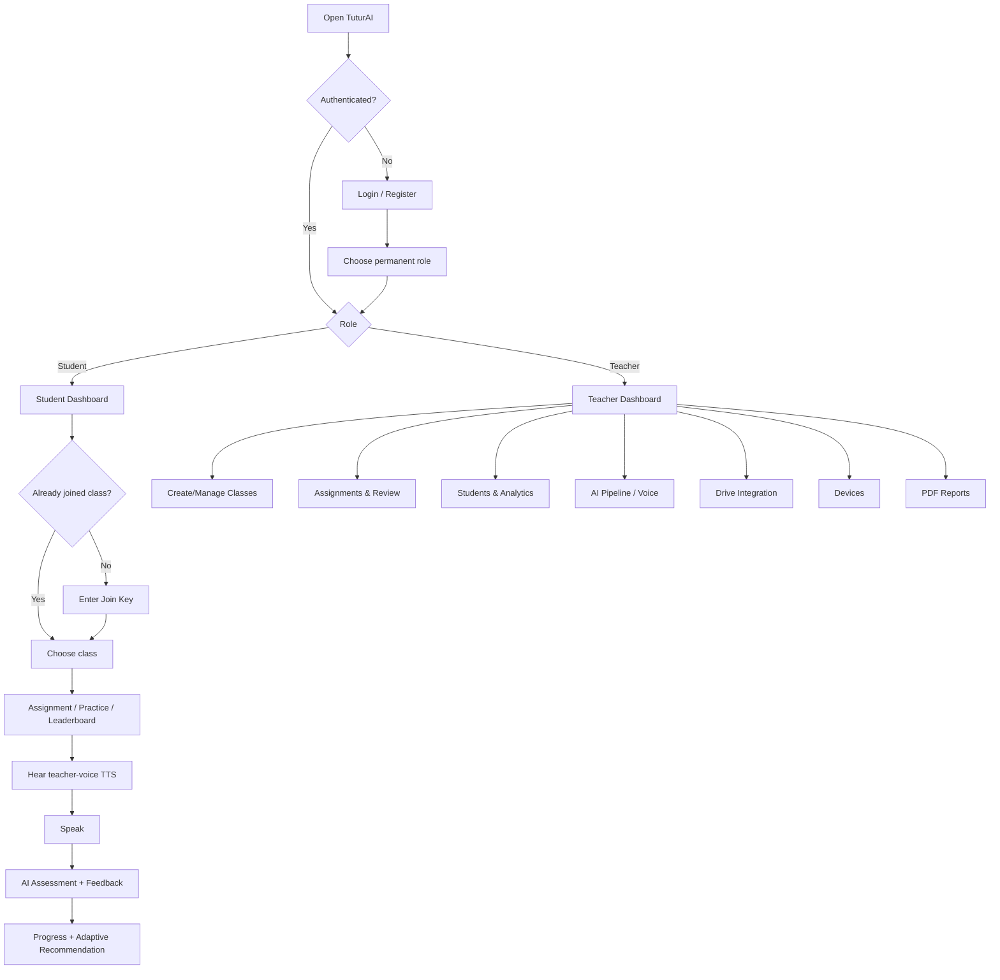
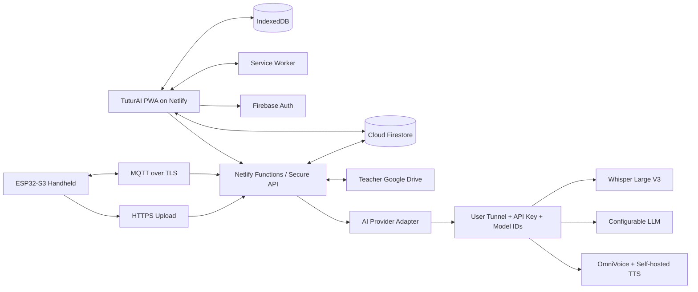
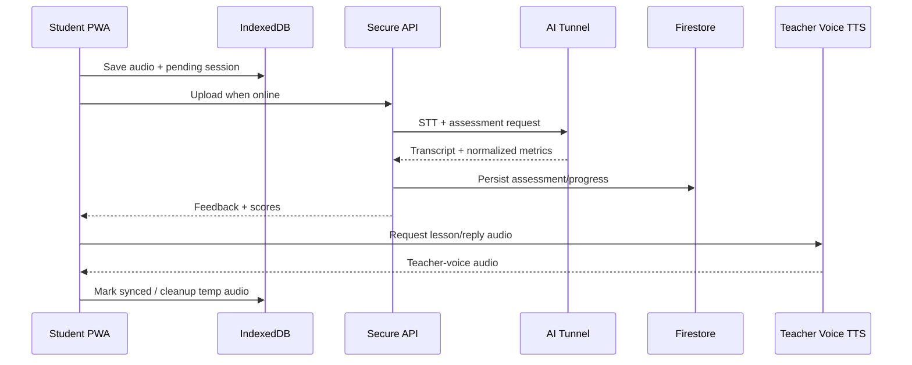
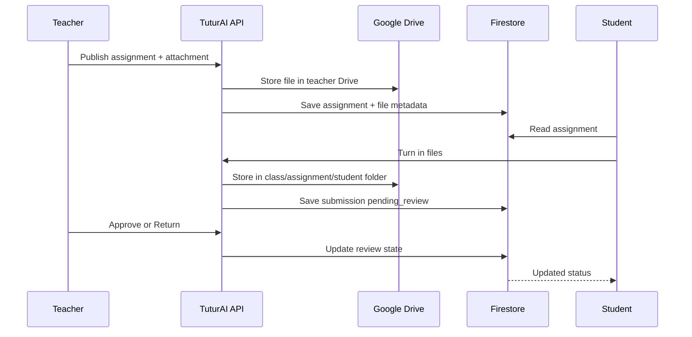
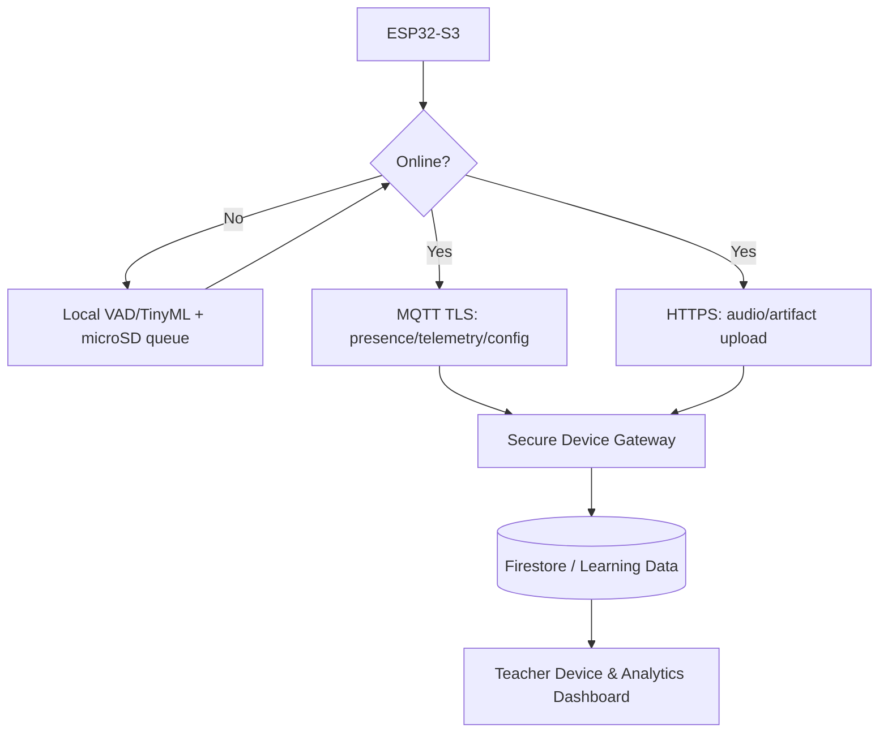

# Product Requirements Document (PRD)

**Nama Proyek:** TuturAI  
**Versi Dokumen:** v0.2
**Terakhir Diperbarui:** 25 September 2026
**Author:** Muhammad Yusuf Aditiya / Maventlabs  
**Dibuat dengan:** AnyMD by Maventlabs

> Dokumen ini berpasangan dengan `AGENTS.md`. `PRD.md` mendefinisikan **apa yang dibangun**; `AGENTS.md` mendefinisikan **bagaimana agent bekerja di proyek ini**. Keduanya wajib dibaca sebelum implementasi.
>
> **Source of truth:** proposal LIDM TuturAI dipakai sebagai baseline produk/pedagogi; web dan repository aktif dipakai sebagai baseline implementasi; keputusan produk terbaru di PRD ini mengalahkan nama model/stack AI lama di proposal. Model AI harus tetap dapat diganti melalui konfigurasi.
>
> Target dokumen mengikuti template: ringkas tetapi lengkap, tanpa placeholder fungsional, dead interaction, atau simulated success.

## Agent Execution Policy: Credential Gates

**JANGAN BERHENTI SAMA SEKALI JIKA EMNG BUTUH CREDENTIAL SKIP/LEWATI DULU KERJAKAN YANG ADA DULU SAMPAI SEMUANYA SELESAI KLO GK SELESAI TUNDA DENGAN CARA MELEWATI TASK TERSEBUT SAMPAI SAYA MEMBERIKAN CREDETIAL YANG DI BUTUHKAN.**

Operational interpretation:

- Credential-gated work must be marked `deferred` with the exact missing provider, variable names, endpoint contract, and verification command.
- Continue all independent implementation, tests, documentation, protocol schemas, local mocks, failure paths, security checks, and deployment configuration while a credential-gated task is deferred.
- A deferred task must never be represented as successful, and a mock must never masquerade as a production provider.
- Do not rerun a completed verification unless related code or configuration changed, or the previous command failed.
- Do not leave a vague `blocked` note. Record the concrete handoff needed to resume the task.
- Production deployment, irreversible migrations, credential rotation, and destructive operations remain explicit approval gates.

## Readiness Accounting

Track two separate values:

- `Implementation readiness`: code, contracts, tests, security controls, deployment configuration, and local verification that do not require external provider confirmation.
- `Production release readiness`: the complete product, including real provider execution, Netlify deployment, rollback, hardware-in-loop verification, and production monitoring.

The implementation target is at least 80% before external credentials are supplied. Production release readiness cannot be marked green until real external confirmations exist.

---

## Implementation Notes: Question Bank

The first durable learning-question slice uses a server-only Firestore `questionBank` collection. Published items expose only their prompt, options, skill, level, tags, and explanation to students; `correctOption` remains server-side. Student answers are written through the protected question-bank API with an idempotency key, and valid answers update the student's durable XP in a server transaction.

The initial seed contains 30 authored questions across grammar, vocabulary, and reading at beginner, intermediate, and advanced levels. The seed command is `pnpm --filter @tuturai/web seed:question-bank`; deterministic IDs and create-only writes prevent accidental duplication or overwriting.


## 1. Product Overview

**Deskripsi Produk:**  
TuturAI adalah platform **adaptive speaking learning** untuk siswa SMA/SMK yang menggabungkan PWA offline-first, asesmen speaking multidimensi berbasis AI, classroom workflow guru-siswa, learning analytics, gamification, serta suara sintetis yang menggunakan **voice profile guru**. Sistem memberi ruang latihan berbicara yang aman, personal, dan terukur, sementara guru dapat membuat kelas, memberikan assignment, meninjau submission, memonitor performa individu/kelas, dan mengekspor laporan PDF.

TuturAI merupakan satu ekosistem web + hardware. Rilis awal berfokus pada PWA dan AI cloud milik proyek; fase berikutnya menghubungkan handheld ESP32-S3 yang sudah dirancang di proposal/RAB ke dashboard melalui protokol perangkat tanpa memisahkannya menjadi produk lain.

**Problem Statement:**  
Siswa sering memahami bahasa Inggris secara pasif tetapi kesulitan berbicara karena speaking anxiety, takut salah, minim kesempatan latihan, serta keterbatasan feedback personal pada kelas padat. Guru juga kesulitan menilai speaking setiap siswa secara konsisten, cepat, dan berbasis data. Di sisi lain, konektivitas yang tidak selalu stabil membuat solusi cloud-only kurang ideal untuk penggunaan pendidikan yang merata.

**Target User:**
- **Siswa SMA/SMK:** latihan speaking, menerima feedback adaptif, menyelesaikan assignment, melihat progres, XP/streak, dan leaderboard.
- **Guru Bahasa Inggris:** mengelola kelas, assignment, review/approval, voice profile, learning analytics, perangkat, dan laporan.
- **Sekolah:** menggunakan TuturAI sebagai infrastruktur pembelajaran speaking dan, pada fase hardware, mengelola perangkat TuturAI.

**Bahasa Output:**  
UI utama Bahasa Indonesia. Materi latihan, contoh speaking, transkrip, dan target ujaran dapat menggunakan Bahasa Inggris. Pertahankan Unicode apa adanya; jangan melakukan silent normalization pada input user.

**Platform Support:**  
Responsive Web/PWA untuk desktop dan mobile browser, deploy utama di **Netlify**. Hardware pendamping ESP32-S3 masuk dalam produk dan diintegrasikan pada fase perangkat. Tidak ada native iOS/Android app pada scope saat ini.

**Out of Scope:**
- Login GitHub, Facebook, Apple, atau provider sosial lainnya selain Google.
- Telegram/WhatsApp delivery dan bot messaging.
- Pembayaran/subscription/billing.
- Native mobile application.
- Multi-voice profile per guru; satu guru hanya memiliki satu voice profile aktif.
- Firebase Storage sebagai storage assignment utama.
- Video conference/live classroom.
- High-stakes automated exam grading tanpa teacher review.
- Mengunci produk pada Qwen/Wav2Vec2/Gemma atau model lama proposal; provider AI harus replaceable.

---

## 2. Unique Selling Proposition (USP)

TuturAI memadukan **safe speaking environment**, feedback AI multidimensi, classroom management ala LMS, teacher-voice TTS, offline-first PWA, learning analytics, dan jalur hardware Edge AI dalam satu pengalaman pendidikan.

- **Diferensiasi utama:** siswa dapat berlatih dengan feedback AI dan mendengar output TTS menggunakan suara gurunya sendiri, bukan suara generik.
- **Diferensiasi pembelajaran:** asesmen tidak hanya menghasilkan skor akhir, tetapi profil pronunciation, fluency, intonation, grammar, dan vocabulary yang dipakai adaptive learning.
- **Diferensiasi guru:** classroom, assignment, review/approval, monitoring siswa, analytics, Drive, voice pipeline, device management, dan PDF report berada pada dashboard yang sama.
- **Diferensiasi infrastruktur:** PWA local-first tetap menyimpan draft/rekaman antrean saat koneksi buruk, lalu melakukan sinkronisasi ketika online.
- **Diferensiasi deployment:** file pembelajaran menggunakan Google Drive milik guru; metadata dan state menggunakan Firestore; AI inference memakai tunnel/API milik proyek sehingga biaya dan provider dapat dikendalikan.
- **Diferensiasi hardware:** handheld ESP32-S3 dari proposal tetap menjadi bagian roadmap produk dan terhubung ke dashboard melalui device protocol.

---

## 3. Fitur & Sub-Fitur

### Fitur 1: Authentication & Permanent Role RBAC
**Deskripsi:** Authentication production melalui Google atau email+password. Role dipilih saat registrasi dan tidak dapat diubah user setelah akun dibuat.
**Prioritas:** P0  
**Bergantung pada:** Tidak ada

- **Email/password & Google Sign-In** — Firebase Authentication sebagai identity provider.
  - Acceptance criteria: kedua metode login bekerja end-to-end; logout dan session restore valid; UI login/registrasi tidak menyediakan GitHub atau provider sosial lain.
- **Permanent role selection** — user memilih `student` atau `teacher` saat onboarding pertama.
  - Acceptance criteria: role tersimpan satu kali, perubahan role dari client ditolak oleh backend/security rules.
- **Route guard** — dashboard, API, dan data dibatasi berdasarkan role.
  - Acceptance criteria: siswa tidak dapat mengakses aksi teacher dan sebaliknya.

### Fitur 2: Classroom & Join Key
**Deskripsi:** Guru dapat membuat banyak kelas; setiap kelas memiliki join key unik. Siswa memasukkan key satu kali untuk bergabung dan kelas kemudian tersimpan di akun.  
**Prioritas:** P0  
**Bergantung pada:** Fitur 1

- **Create/manage classroom** — nama kelas, sekolah, deskripsi opsional, status aktif/arsip.
- **Unique join key** — key stabil sampai guru melakukan regenerate/revoke.
  - Acceptance criteria: collision dicegah; key invalid/revoked tidak dapat digunakan.
- **Join class** — siswa dapat bergabung ke lebih dari satu kelas dari menu kelas.
  - Acceptance criteria: membership tidak duplikat dan langsung muncul pada dashboard siswa/guru.
- **Member management** — guru melihat daftar siswa dan dapat menghapus membership bila diperlukan.

### Fitur 3: Assignment & Google Drive Integration
**Deskripsi:** Workflow assignment mengikuti mental model Google Classroom: guru publish tugas untuk satu kelas, siswa submit, guru review lalu approve atau return.  
**Prioritas:** P0  
**Bergantung pada:** Fitur 1–2

- **Create assignment** — title, instruction, due date, max attempts, attachments, link, dan status draft/published.
- **Teacher Drive connection** — Google Drive OAuth terpisah dari login TuturAI dan bukan metode sign-in aplikasi; gunakan scope minimum `drive.file`.
  - Acceptance criteria: guru dapat connect, reconnect, disconnect, dan melihat folder TuturAI.
- **File storage** — attachment dan submission file diarahkan ke Google Drive guru; Firestore hanya menyimpan metadata/file ID.
- **Supported source** — upload gambar/dokumen atau external link.
- **Submission state** — `assigned → in_progress → submitted/pending_review → approved` atau `returned → resubmit`.
  - `isLate` dihitung dari due date; tidak mengganti state review.
- **Attempt control** — max attempt dapat diatur guru per assignment.
- **Teacher review** — guru dapat memberi note/feedback, approve, atau return.
  - Acceptance criteria: returned submission hanya dapat resubmit bila attempt tersisa; approved dianggap final.

### Fitur 4: Student Learning Experience
**Deskripsi:** Pusat aktivitas siswa untuk latihan speaking mandiri dan assignment berbasis speaking.  
**Prioritas:** P0  
**Bergantung pada:** Fitur 1–3

- **Student dashboard** — level, XP, streak, rank, assignment terdekat, rekomendasi adaptif, dan recent activity.
- **Speaking practice** — rekam ucapan, tampilkan transkrip, skor dan feedback.
- **AI conversation** — skenario percakapan adaptif dengan respons kontekstual.
- **Pronunciation practice** — latihan kata/kalimat dengan feedback fonetik/pronunciation.
- **Vocabulary practice** — kartu/interaksi vocabulary dengan mastery tracking.
- **Leaderboard** — ranking per kelas berdasarkan aturan scoring yang transparan.
- **Teacher-voice playback** — audio tutor/TTS menggunakan voice profile guru dari kelas aktif.

### Fitur 5: AI Assessment & Adaptive Learning Pipeline
**Deskripsi:** AI pipeline dinormalisasi ke kontrak internal sehingga provider/model dapat diganti tanpa mengubah domain aplikasi.  
**Prioritas:** P0  
**Bergantung pada:** Fitur 4

- **STT** — Whisper Large V3 melalui API key/provider endpoint.
- **Assessment** — hasil minimum: pronunciation, fluency, intonation, grammar, vocabulary, overall score, transcript, feedback, confidence/error metadata.
- **LLM analysis** — sementara dapat menggunakan Gemma melalui API, tetapi `model_id`, base URL, dan provider wajib configurable.
- **AI environment policy** — konfigurasi `v1` yang dipakai STT/LLM wajib tersedia server-side. Konfigurasi `local` untuk OmniVoice/TTS boleh kosong sampai provider self-hosted selesai dibuat; kosong pada `AI_LOCAL_BASE_URL` dan `AI_TTS_MODEL_ID` dalam `.env.local` bukan credential blocker dan tidak boleh dianggap sebagai simulated success.
- **Google environment policy** — Firebase Google Sign-In memakai konfigurasi provider Firebase yang sudah ada; jangan membuat client key Google kedua untuk login. Drive OAuth dan callback Google server-side harus memakai satu shared OAuth client (`GOOGLE_OAUTH_CLIENT_ID`, `GOOGLE_OAUTH_CLIENT_SECRET`, `GOOGLE_OAUTH_REDIRECT_URI`) dan token encryption key server-only.
- **Adaptive engine** — rekomendasi materi dan difficulty berdasarkan histori lima dimensi, assignment, dan performa terbaru.
- **Provider adapter/fallback** — internal interface mendukung tunnel v1, API key, model ID, sync/async inference, timeout, retry, dan explicit error.
  - Acceptance criteria: kegagalan AI tidak boleh menghasilkan fake score atau simulated success.

### Fitur 6: Teacher Voice Clone & TTS Pipeline
**Deskripsi:** Satu voice profile per guru digunakan untuk menghasilkan audio tutor yang didengar siswa di kelas guru tersebut.  
**Prioritas:** P0  
**Bergantung pada:** Fitur 1, Fitur 5

- **Voice enrollment** — guru merekam/mengunggah sample melalui menu `AI Pipeline / Voice`.
- **OmniVoice cloning** — menghasilkan voice profile/reference yang terikat ke `teacherId`.
- **Self-hosted TTS** — teks pembelajaran disintesis dengan profile guru.
- **Profile lifecycle** — status `not_configured`, `processing`, `ready`, `failed`; guru dapat replace profile.
- **Consent & deletion** — enrollment harus eksplisit; guru dapat menghapus/re-enroll profile.
  - Acceptance criteria: voice siswa/guru A tidak pernah digunakan untuk kelas guru B.

### Fitur 7: Teacher Dashboard & Learning Analytics
**Deskripsi:** Control center untuk kelas, siswa, assignment, speaking review, voice pipeline, analytics, report, dan device.  
**Prioritas:** P0  
**Bergantung pada:** Fitur 1–6

- **Overview** — active classes, active students, completion, average speaking score, students needing attention.
- **Class analytics** — trend skor, distribution, latihan, recurring errors, progress terhadap target.
- **Student detail** — histori lima dimensi, overall score, streak, assignment, teacher notes, activity.
- **Review queue** — submission/speaking yang memerlukan approval guru.
- **Assignment management** — draft/publish/review/return/approve.
- **Voice Pipeline menu** — enrollment dan status satu voice profile.
- **Device menu** — status perangkat saat hardware diaktifkan.
- **Reports menu** — generate/export PDF dari data terpilih.

### Fitur 8: Offline-First PWA & Synchronization
**Deskripsi:** PWA harus tetap usable pada koneksi buruk dengan pemisahan data durable cloud dan cache/draft lokal.  
**Prioritas:** P0  
**Bergantung pada:** Fitur 1–7

- **IndexedDB** — draft, assignment cache, audio queue, assessment cache, progress cache, pending sync.
- **Service Worker/Cache Storage** — app shell dan asset penting tersedia offline.
- **Sync queue** — operasi pending memakai idempotency key dan retry/backoff.
- **Conflict handling** — server menjadi source of truth untuk domain durable; draft lokal direkonsiliasi secara eksplisit.
- **Audio retention** — practice audio lokal dihapus setelah proses berhasil kecuali sesi memang membutuhkan teacher review; assignment audio yang harus direview dapat disimpan ke Drive guru.
  - Acceptance criteria: refresh/offline tidak menghilangkan draft; status sync selalu terlihat dan tidak mengklaim synced sebelum server mengonfirmasi.

### Fitur 9: PDF Reports
**Deskripsi:** Guru dapat mengekspor laporan terstruktur dari dashboard tanpa Telegram/WhatsApp delivery.  
**Prioritas:** P1  
**Bergantung pada:** Fitur 7

- **Student report** — identitas, periode, assignment completion, lima dimensi, overall score, trend, common errors, teacher notes, rekomendasi.
- **Class report** — aggregate score, distribution, completion, recurring errors, students needing attention.
- **Export PDF** — layout report didesain khusus dan menyertakan timestamp serta filter periode.
  - Acceptance criteria: PDF sesuai data dashboard dan dapat diunduh tanpa field placeholder.

### Fitur 10: Hardware & Device Integration
**Deskripsi:** Handheld TuturAI tetap satu produk dengan PWA. Dashboard menjadi control/monitoring plane ketika perangkat diaktifkan.  
**Prioritas:** P1  
**Bergantung pada:** Fitur 5, 7, 8

- **Hardware baseline RAB:** ESP32-S3 DevKitC-1 N16R8, TFT ILI9488/XPT2046 3.5", INMP441, MAX98357A, speaker 8Ω, KY-023, tactile buttons, WS2812B, microSD, LiPo 3.7V 5000mAh, charging/boost/regulator, PCB/wiring, dan casing.
- **Firmware:** ESP-IDF + FreeRTOS; local audio capture, VAD/TinyML basic inference, local queue, status UI.
- **Device protocol:** MQTT over TLS untuk telemetry, presence, sync state, battery, dan command/config ringan; HTTPS untuk upload audio/file besar dan firmware artifact.
- **Device registry/pairing:** device memiliki ID/credential unik dan dipair ke sekolah/kelas melalui pairing code.
- **Dashboard monitoring:** online/offline, battery, firmware version, last sync, pending queue.
- **Offline behavior:** device tetap menjalankan fungsi lokal yang tersedia dan menyinkronkan data saat online.
  - Acceptance criteria: perangkat tidak dapat publish/consume topic di luar scope device/class yang diotorisasi.

---

## 4. Development Phases

### Phase 1: Foundation, Auth & Data Model
**Terkait fitur:** Fitur 1

- [x] Pertahankan codebase aktif; rapikan environment dan Netlify deployment.
- [x] Setup Firebase Auth Google + email/password.
- [x] Implement onboarding permanent role dan RBAC.
- [x] Implement Firestore collections, indexes, security rules, emulator/dev configuration.
- [x] Implement shared TypeScript domain types dan API error envelope.
- [x] Tambahkan env schema; tidak ada secret/model ID hardcoded.

**Anggap fase ini selesai kalau:** kedua role dapat register/login dan hanya mengakses data/route yang diizinkan.

**Historical verification evidence (2026-09-22):** student dan teacher berhasil register email/password melalui Firebase cloud (`accounts:signUp` 200), menyelesaikan onboarding (`201`), membuat server session (`200`), dan masuk ke dashboard role masing-masing. Session cookie diverifikasi server-side dengan Firebase session cookie, bukan raw ID token. Logout mengembalikan user ke login; cross-role route guard mengarahkan `/guru` dan `/siswa`; wrong-role API mengembalikan `403 FORBIDDEN`; unauthenticated route mengarahkan ke login. Firestore emulator rules suite lulus 37 tests. Google popup UI pernah tersedia, tetapi browser consent/session proof belum menjadi bukti aktif dan kini diverifikasi oleh `WEB-AUTH-002`.

### Phase 2: Classroom, Student & Teacher Core
**Terkait fitur:** Fitur 2, 4, 7

- [ ] Classroom CRUD, join key generate/regenerate/revoke, membership.
- [ ] Student dashboard dan class switcher.
- [ ] Teacher overview, class list, student list/detail.
- [ ] Leaderboard dan gamification state dasar.

**Anggap fase ini selesai kalau:** guru dapat membuat kelas dan siswa dapat join sekali lalu muncul konsisten pada kedua dashboard.

### Phase 3: Assignment + Google Drive
**Terkait fitur:** Fitur 3

- [ ] Google Drive connect/reconnect/disconnect dengan `drive.file`.
- [ ] Struktur folder TuturAI/class/assignment/submission.
- [ ] Create/publish assignment, due date, max attempts, file/link.
- [ ] Turn-in, late flag, review queue, approve/return/resubmit.
- [ ] Validasi MIME/size dan error recovery upload.

**Anggap fase ini selesai kalau:** satu assignment lengkap dapat berjalan teacher→student→submission→review→approval tanpa storage palsu.

### Phase 4: AI Assessment, Adaptive Learning & Teacher Voice
**Terkait fitur:** Fitur 5–6

- [ ] Implement AI provider abstraction untuk tunnel URL/API key/model ID.
- [ ] Integrasi Whisper Large V3 STT.
- [ ] Normalisasi lima dimensi + overall score + feedback.
- [ ] Adaptive recommendation engine.
- [ ] OmniVoice enrollment satu profile/guru.
- [ ] Self-hosted TTS teacher voice dan student playback.
- [ ] Timeout/retry/error/fallback yang eksplisit.

**Anggap fase ini selesai kalau:** satu speaking session menghasilkan hasil nyata dari provider dan TTS kelas menggunakan voice profile guru yang benar.

**Konfigurasi development saat ini:** `apps/web/.env.local` memiliki konfigurasi `v1` untuk STT/LLM (`AI_V1_BASE_URL`, `AI_V1_API_KEY`, dan model ID terkait). `AI_LOCAL_BASE_URL` serta `AI_TTS_MODEL_ID` sengaja belum diisi karena OmniVoice/TTS self-hosted belum dibangun. Implementasi harus tetap menerima kondisi ini, fail closed bila TTS dipanggil sebelum provider tersedia, dan tidak mengarang audio atau score.

**Historical status sebelum Phase 4 (bukan status eksekusi aktif):** fondasi Firebase/Firestore emulator, auth/session/onboarding, classroom, durable dashboard/gamification, dan sebagian assignment/submission sudah diimplementasikan. Phase 1 cloud auth/rules verification dan Phase 2 classroom checkpoint lulus untuk email/password, role boundaries, teacher create, invalid join-key rejection, student join, serta teacher/student membership visibility. Google popup consent/session dan Google Drive OAuth/upload evidence dipisahkan; `WEB-AUTH-002` memverifikasi Google Sign-In aplikasi, sedangkan Drive tetap gate integrasi tersendiri.

### Phase 5: Offline-First & Sync
**Terkait fitur:** Fitur 8

- [ ] IndexedDB stores dan migration versioning.
- [ ] Service Worker/app-shell cache.
- [ ] Pending sync queue, idempotency, retry/backoff, reconnect.
- [ ] Storage quota check, cleanup, dan user-visible sync status.
- [ ] Test scenario offline→record/draft→online→sync.

**Anggap fase ini selesai kalau:** koneksi terputus tidak menghilangkan pekerjaan dan server tidak menerima duplikasi setelah reconnect.

### Phase 6: Analytics & PDF Reporting
**Terkait fitur:** Fitur 7, 9

- [ ] Agregasi learning analytics kelas/siswa.
- [ ] Trend/distribution/common errors/attention signals.
- [ ] Desain report v1 dan export student/class PDF.
- [ ] Pastikan report mengikuti filter periode dan permission kelas.

**Anggap fase ini selesai kalau:** analytics dashboard dan PDF berasal dari source data yang sama dan konsisten.

### Phase 7: Hardware & Device Plane
**Terkait fitur:** Fitur 10

- [ ] Implement firmware ESP32-S3 berdasarkan BOM/RAB proposal.
- [ ] Audio acquisition, VAD/TinyML dasar, local microSD queue.
- [ ] MQTT over TLS device identity/topic ACL.
- [ ] HTTPS upload untuk audio/artifact besar.
- [ ] Device pairing, registry, battery/online/firmware/last-sync telemetry.
- [ ] Dashboard device status dan safe commands/config.
- [ ] Uji offline→online synchronization perangkat.

**Anggap fase ini selesai kalau:** handheld fisik dapat dipair, bekerja lokal sesuai capability, lalu sinkron dan termonitor dari dashboard.

### Phase QA: Pengujian & Verifikasi
**Terkait fitur:** Seluruh fitur P0 dan integrasi P1 yang telah diaktifkan

- [ ] Unit test business logic: role, join key, attempts, assignment state, scoring normalization, sync reducer.
- [ ] Integration test API: Firebase token verification, Drive, AI adapter, report, device endpoints.
- [ ] E2E teacher dan student: happy path + minimal satu edge case per fitur P0.
- [ ] Offline/reconnect test dan duplicate/idempotency test.
- [ ] Voice profile isolation test dan AI failure test.
- [ ] Responsive/accessibility smoke test mobile + desktop.
- [ ] Verifikasi seluruh acceptance criteria.
- [ ] Tidak ada dead button, placeholder interaction, mocked success, atau fake upload.

**Anggap fase ini selesai kalau:** seluruh P0 lulus acceptance criteria, E2E utama hijau, dan tidak ada blocking bug.

### Phase Security: Keamanan Aplikasi
**Terkait fitur:** Seluruh fitur auth, user input, file, AI, Drive, dan device

- [ ] Input validation/sanitization, XSS/injection review.
- [ ] Secrets hanya server-side env; tidak ada AI key/Drive token di bundle client.
- [ ] Firestore Security Rules + server authorization test.
- [ ] Role immutability dan classroom ownership/membership enforcement.
- [ ] Join key brute-force protection dan rate limiting.
- [ ] OAuth `state`/callback validation, least-privilege Drive scope, encrypted refresh token storage.
- [ ] MIME/size/file-name validation untuk upload.
- [ ] Voice sample/privacy review dan deletion path.
- [ ] MQTT TLS credentials/topic ACL; credential rotation.
- [ ] Dependency/vulnerability scan.

**Anggap fase ini selesai kalau:** credential tidak terekspos, cross-user/cross-class access ditolak, dan tidak ada vulnerability blocking yang diketahui.

### Phase 10: Pilot Validation & Release
**Terkait fitur:** Seluruh scope siap rilis

- [ ] Pilot guru Bahasa Inggris dan siswa sesuai rencana validasi.
- [ ] SUS/usability, acceptance, speaking confidence, dan feedback pedagogis.
- [ ] Target awal usability: learnability, efficiency, satisfaction masing-masing >80%.
- [ ] Regression setelah feedback pilot.
- [ ] Netlify production deploy dan rollback checklist.

**Anggap fase ini selesai kalau:** release candidate stabil, pilot tervalidasi, dan deployment production dapat direproduksi.

---

## 5. Tech Stack

| Layer | Teknologi | Alasan Pemilihan |
|---|---|---|
| Frontend | React + TypeScript PWA; pertahankan toolchain repo aktif | Codebase web existing, typed domain, responsive PWA |
| UI | Existing component system + CSS/Tailwind bila sudah dipakai repo | Hindari replatform tanpa manfaat |
| Backend/API | Netlify Functions (Node/TypeScript) | Server-side secret, Drive OAuth/upload, Firebase Admin, AI proxy |
| Database | Firebase Cloud Firestore | Free-tier-first, realtime state, security rules |
| Auth | Firebase Authentication | Google + email/password |
| Local data | IndexedDB + Service Worker + Cache Storage | Offline-first drafts/audio queue/cache |
| File storage | Google Drive milik guru | Tidak membutuhkan Firebase Storage; ownership tetap pada guru |
| AI Gateway | Tunnel/API milik proyek; provider/model configurable | Model tidak di-hardcode |
| STT | Whisper Large V3 via configured API | Speech-to-text pipeline |
| Voice | OmniVoice + self-hosted TTS | Satu cloned voice profile per guru |
| PDF | Client/server PDF renderer sesuai implementation repo | Export dashboard report |
| Hardware | ESP32-S3 N16R8, ESP-IDF, FreeRTOS, TinyML | Edge/offline device |
| Device transport | MQTT over TLS + HTTPS | Telemetry/command ringan + transfer besar |
| Hosting/Deploy | Netlify | PWA/web production target |
| CI/Test | GitHub Actions + unit/integration/E2E runner repo | Regression dan release gate |

---

## 5A. Visual Direction (Preset Terbatas)

**Preset terpilih:** `precision-blue` — light, bersih, akademik, dan cukup netral untuk student experience serta teacher analytics.

| Semantic Role | Nilai |
|---|---|
| canvas | `#f5f5f7` |
| surface | `#ffffff` |
| text | `#1d1d1f` |
| mutedText | `#6e6e73` |
| primary | `#2f6df5` |
| primaryText | `#ffffff` |
| border | `#d2d2d7` |
| accent | `#0071e3` |
| display font | Inter |
| body font | Inter |
| monospace font | IBM Plex Mono |

**Batasan eksplisit:** tidak ada decorative gradient tanpa fungsi, generic shadow pada semua card, icon campur-gaya, eyebrow ALL-CAPS berulang, motion otomatis berlebihan, emoji sebagai ikon UI, atau warna tambahan tanpa alasan aksesibilitas/status. Hierarki dashboard harus berasal dari layout, typography, spacing, data density, dan state yang jelas.

---

## 6. Database Schema Diagram

> Firestore bersifat document database; diagram berikut adalah **conceptual domain schema**, bukan relational SQL requirement.



**Data sensitif/perlu perhatian:** akun siswa, data sekolah/kelas, rekaman suara, transcript, voice-clone sample/profile, OAuth Drive token, AI credentials, device credentials. OAuth refresh token hanya disimpan encrypted dan server-only. AI/API key tidak boleh disimpan di Firestore yang dapat dibaca client.

---

## 7. API Documentation

Semua endpoint server menerima `Authorization: Bearer <Firebase ID Token>` kecuali OAuth callback/device endpoint yang memiliki mekanisme auth sendiri.

### User & Onboarding

| Method | Endpoint | Deskripsi | Request Body | Response |
|---|---|---|---|---|
| POST | `/api/onboarding/complete` | Simpan profile + permanent role | `{ displayName, school, role }` | `{ user }` |
| GET | `/api/me` | Profile dan capability user | - | `{ user, permissions }` |

### Classroom

| Method | Endpoint | Deskripsi | Request Body | Response |
|---|---|---|---|---|
| POST | `/api/classes` | Teacher membuat kelas | `{ name, description? }` | `{ class, joinKey }` |
| GET | `/api/classes` | List kelas user | - | `{ classes[] }` |
| POST | `/api/classes/:id/join-key/regenerate` | Ganti key | - | `{ joinKey }` |
| POST | `/api/classes/join` | Student join dengan key | `{ joinKey }` | `{ membership, class }` |
| GET | `/api/classes/:id/members` | Teacher lihat anggota | - | `{ members[] }` |

### Assignment & Review

| Method | Endpoint | Deskripsi | Request Body | Response |
|---|---|---|---|---|
| POST | `/api/classes/:id/assignments` | Create/publish assignment | `{ title, instructions, dueAt, maxAttempts, links[] }` | `{ assignment }` |
| POST | `/api/assignments/:id/submit` | Turn-in/resubmit | `{ files[], note? }` | `{ submission }` |
| POST | `/api/submissions/:id/approve` | Teacher approve | `{ feedback? }` | `{ submission }` |
| POST | `/api/submissions/:id/return` | Return ke siswa | `{ feedback }` | `{ submission }` |

### Google Drive

| Method | Endpoint | Deskripsi | Request Body | Response |
|---|---|---|---|---|
| GET | `/api/integrations/google-drive/connect` | Mulai OAuth Drive | - | Redirect |
| GET | `/api/integrations/google-drive/callback` | OAuth callback | query code/state | Redirect dashboard |
| POST | `/api/integrations/google-drive/upload` | Upload ke Drive guru | multipart | `{ fileId, name, webViewLink }` |
| DELETE | `/api/integrations/google-drive` | Disconnect | - | `{ disconnected: true }` |

### AI & Voice

| Method | Endpoint | Deskripsi | Request Body | Response |
|---|---|---|---|---|
| POST | `/api/ai/speaking-sessions` | Start/process speaking | audio + metadata | `{ sessionId, jobId/status }` |
| GET | `/api/ai/jobs/:id` | Status/result normalized | - | `{ status, assessment? }` |
| POST | `/api/voice/enroll` | Create/replace teacher voice | audio samples | `{ profileId, status }` |
| GET | `/api/voice/profile` | Voice profile status | - | `{ profile }` |
| POST | `/api/voice/synthesize` | TTS teacher voice | `{ text, classId }` | audio/asset reference |
| DELETE | `/api/voice/profile` | Delete voice profile | - | `{ deleted: true }` |

### Analytics & Reports

| Method | Endpoint | Deskripsi | Request Body | Response |
|---|---|---|---|---|
| GET | `/api/analytics/classes/:id` | Aggregate learning analytics | query period | `{ metrics, trends, alerts }` |
| GET | `/api/analytics/students/:id` | Student detail | query period | `{ profile, trends, assignments }` |
| POST | `/api/reports` | Generate report | `{ type, classId, studentId?, period }` | PDF/file response |

### Device

| Method | Endpoint | Deskripsi | Request Body | Response |
|---|---|---|---|---|
| POST | `/api/devices/pair` | Pair device | `{ pairingCode }` | `{ device, credentials }` |
| GET | `/api/devices` | Teacher list devices | - | `{ devices[] }` |
| POST | `/api/devices/:id/command` | Safe command/config | `{ command, payload }` | `{ accepted }` |
| POST | `/api/devices/:id/upload` | Upload audio/artifact via HTTPS | binary + metadata | `{ accepted, syncId }` |

---

## 8. Additional Diagrams

### User Flow



### Architecture Diagram



### Speaking Session Sequence



### Assignment + Drive Sequence



### Device Synchronization



---

## 9. Prompt Inisiasi untuk Agent

```text
Baca PRD.md dan AGENTS.md di root proyek TuturAI, lalu mulai Phase 1.
Pertahankan codebase aktif dan target deploy Netlify. Gunakan skill yang
terinstal dan relevan sesuai AGENTS.md, lalu laporkan skill yang dipakai.
Jangan hardcode AI provider/model, jangan expose credential di client,
jangan membuat placeholder/dead interaction/simulated success, dan jangan
mengganti Google Drive dengan Firebase Storage tanpa keputusan produk baru.

Implementasikan setiap flow end-to-end beserta test dan acceptance criteria.
Setelah verification suatu phase lulus, lanjut otomatis ke phase berikutnya.
Pause hanya untuk credential, tindakan destructive/irreversible, real payment,
production change, atau keputusan produk yang benar-benar belum terselesaikan.
Phase QA dan Phase Security wajib lulus sebelum release dianggap selesai.
```

---

## Changelog

| Tanggal | Perubahan |
|---|---|
| 25 September 2026 | Scope auth dikoreksi kembali menjadi Google + email/password; GitHub tetap di luar scope. `WEB-AUTH-002` diaktifkan kembali untuk verifikasi browser/provider; Drive OAuth tetap integrasi terpisah. |
| 25 September 2026 | Historical decision (superseded by the entry above and §1): production auth was considered email/password-only; Google is now in scope, while GitHub remains out of scope. Drive OAuth stays separate; prior verification evidence is retained as historical. |
| 21 September 2026 | Draft v0.1 TuturAI berdasarkan proposal LIDM, produk aktif, dan keputusan final: Firebase/Netlify, classroom key, assignment+Drive, AI tunnel, teacher voice cloning, offline-first, PDF report, dan hardware integration. |
| 18 September 2026 | Baseline template AnyMD: kontrak bahasa/Unicode, preset visual, functional-only output, skill recommendation, QA/Security, dan auto-continue antar-phase. |
